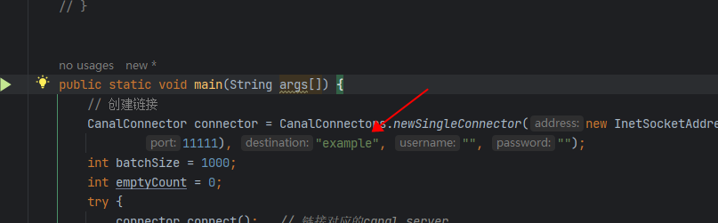

- mysql开启binlog

```cnf
[mysqld]
# 服务器唯一id，默认值1
server-id=1
# 设置日志格式，默认值ROW
binlog_format=ROW
# 二进制日志名，默认binlog
# log-bin=binlog
# 设置需要复制的数据库，默认复制全部数据库
#binlog-do-db=mytestdb
# 设置不需要复制的数据库
#binlog-ignore-db=mysql
#binlog-ignore-db=infomation_schema
```

- 添加用户，设置读权限
    - 参考尚硅谷的文档，如果少了权限，可能会无法监听到数据

```sql
CREATE USER 'canal_demo'@'%';
ALTER USER 'canal_demo'@'%' IDENTIFIED WITH mysql_native_password BY '123456';
GRANT SELECT, REPLICATION SLAVE, REPLICATION CLIENT ON *.* TO 'canal_demo'@'%';
FLUSH PRIVILEGES;
```

- 安装canal
- 修改canal配置

```properties
#################################################
######### 		destinations		#############
#################################################
canal.destinations=example,canal_slave
```

- 添加多个节点：`example,canal_slave`

1. 节点1： `conf/example/instance.properties`

```properties
# slave节点id
canal.instance.mysql.slaveId=100
# 用户名密码
# username/password
canal.instance.dbUsername=atguigu_slave
canal.instance.dbPassword=123456
```

2. 节点2：`conf/canal_slave.instance.properties`

```properties
# slave节点id
canal.instance.mysql.slaveId=101
# 用户名密码
# username/password
canal.instance.dbUsername=canal
canal.instance.dbPassword=123456
```

- 程序启动时指定destination
  


## 关于数据同步与丢失的问题

- 如果canal-server下线，再重连，会丢失数据吗？
    - 不会，因为canal-server重启后，会再次同步mysql的binlog日志
- 如果canal-client下线，再重连，会丢失数据吗？
    - 不会，因为canal-server一直在同步mysql binlog的日志
    - 等canal-client连接上canal-server的时候，就可以从上次还没有ack的消息开始读
